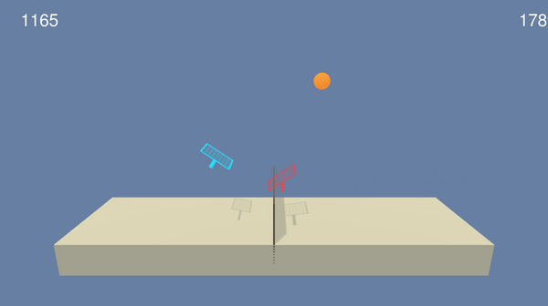

# Collaboration Competition
PPO (Proximal Policy Optimization)

### Introduction

For this project, two agents control rackets are trained to bounce a ball over a net. If an agent hits the ball over the net, it receives a reward of +0.1.  If an agent lets a ball hit the ground or hits the ball out of bounds, it receives a reward of -0.01.  Thus, the goal of each agent is to keep the ball in play.

The task is episodic, and the environment is considered to be solved, when the agents get an average score of +1 (over 100 consecutive episodes, after taking the maximum over both agents). Specifically,

- After each episode, the rewards are added up that each agent received (without discounting), to get a score for each agent. This yields 2 (potentially different) scores. Then the maximum of these 2 scores is taken into account.
- This yields a single **score** for each episode.

#### State-Action Represenation

- Observation space type: continuous
    - Observation space size (per agent): 8, corresponding to:
        - position and velocity of ball and racket
- Action space type: discrete
    - Action space size (per agent): 2 (continuous), corresponding to:
        - movement toward net or away from net, and jumping
	
### Getting Started

1. conda create --name colabcompet python=3.6
2. conda activate colabcompet
3. conda install jupyter
4. pip install gym
   (make sure that pip is acting in your environment "type pip")
5. conda install pytorch=0.4.0 -c pytorch
6. cd C:\Users\YOUR_USERNAME\Documents\GitHub\Collaboration-Competition\python
7. pip install .
8. install XQuartz from here: https://www.xquartz.org
   (remember to restart your mac)
9. Download the pre-compiled Unity Environment to "data" folder (20 Agents):
    - Linux: [click here](https://s3-us-west-1.amazonaws.com/udacity-drlnd/P3/Tennis/Tennis_Linux.zip)
    - Mac OSX: [click here](https://s3-us-west-1.amazonaws.com/udacity-drlnd/P3/Tennis/Tennis.app.zip)
    - Windows (32-bit): [click here](https://s3-us-west-1.amazonaws.com/udacity-drlnd/P3/Tennis/Tennis_Windows_x86.zip)
    - Windows (64-bit): [click here](https://s3-us-west-1.amazonaws.com/udacity-drlnd/P3/Tennis/Tennis_Windows_x86_64.zip)
10. Follow the instructions in `colabcompet.ipynb` to get started!