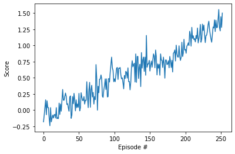

# Collaboration Competition
PPO (Proximal Policy Optimization)


### Introduction

For this project, two agents control rackets are trained to bounce a ball over a net. If an agent hits the ball over the net, it receives a reward of +0.1.  If an agent lets a ball hit the ground or hits the ball out of bounds, it receives a reward of -0.01.  Thus, the goal of each agent is to keep the ball in play.

The task is episodic, and the environment is considered to be solved, when the agents get an average score of +1 (over 100 consecutive episodes, after taking the maximum over both agents). Specifically,

- After each episode, the rewards are added up that each agent received (without discounting), to get a score for each agent. This yields 2 (potentially different) scores. Then the maximum of these 2 scores is taken into account.
- This yields a single **score** for each episode.

#### State-Action Represenation

- Observation space type: continuous
    - Observation space size (per agent): 8, corresponding to:
        - position and velocity of ball and racket
- Action space type: discrete
    - Action space size (per agent): 2 (continuous), corresponding to:
        - movement toward net or away from net, and jumping
	
### Learning Algorithm
In recent years, several different approaches have been proposed for reinforcement learning with neural network function approximators. The leading contenders are deepQ-learning,'vanilla' policy gradient methods, and trust region / natural policy gradient methods. Q-learning (with function approximation) fails on many simple problems, vanilla policy gradient methods have poor robustness;  and  trust  region  policy  optimization  (TRPO) is not compatible with architectures that include noise (such as dropout) or parameter sharing (between the policy and value function, or with auxiliary tasks). For this project, proximal policy optimization is used, it uses multiple epochs of stochastic gradient ascent to perform each policy update. This methods have the stability and reliability of trust-region methods but are much simpler to implement, requiring only few lines of code change to a vanilla policy gradient implementation.[Schulman et al](https://arxiv.org/abs/1707.06347)

PPO calculates gradient based on the policy likelihood ratio between old and new policy, and leverages ratio clipping to avoid gradient explosion. GAE (Generalized Advantage Estimation) method was used to estimate the advantage function.


### Result & Plot of Rewards
The environment was solved in under 253 episodes.

```bash
Episode: 10, average score: -0.03
Episode: 20, average score: -0.05
Episode: 30, average score: -0.01
Episode: 40, average score: 0.02
Episode: 50, average score: 0.04
Episode: 60, average score: 0.05
Episode: 70, average score: 0.08
Episode: 80, average score: 0.11
Episode: 90, average score: 0.14
Episode: 100, average score: 0.18
Episode: 110, average score: 0.24
Episode: 120, average score: 0.30
Episode: 130, average score: 0.35
Episode: 140, average score: 0.40
Episode: 150, average score: 0.47
Episode: 160, average score: 0.53
Episode: 170, average score: 0.58
Episode: 180, average score: 0.62
Episode: 190, average score: 0.66
Episode: 200, average score: 0.70
Episode: 210, average score: 0.75
Episode: 220, average score: 0.81
Episode: 230, average score: 0.87
Episode: 240, average score: 0.92
Episode: 250, average score: 0.98
Environment solved in 253 episodes!	Average Score: 1.00
Average Score: 1.00
Elapsed time: 0:12:34.734125
Saving checkpoint!
```

The following figure illustrates the average score over time obtained during training:



The model was evaluated after training by loading `checkpoint.pth`, and running the environment in evaluation mode (i.e. `train_mode=False`):

```bash
Episode: 1, score: -0.004999999888241291
Episode: 2, score: 0.04500000085681677
Episode: 3, score: 0.04500000085681677
Episode: 4, score: 0.032500000670552254
Episode: 5, score: 0.025000000558793544
Episode: 6, score: 0.02000000048428774
Episode: 7, score: 0.016428571859640733
Episode: 8, score: 0.013750000391155481
Episode: 9, score: 0.011666667026778063
Episode: 10, score: 0.010000000335276127
```

### Network Architecture
An actor-critic structure with continuous action space was used for this project. The policy consists of 3 parts, a shared hidden layers, actor, and critic.
The actor layer outputs the mean value of a normal distribution, from which the agent's action is sampled. The critic layer yields the value function.

- Shared layer:
```
Input State(33) -> Dense(128) -> LeakyReLU -> Dense(128) -> LeakyReLU*
```
- Actor and Critic layers:
```
LeakyRelu* -> Dense(64) -> LeakyRelu -> Dense(4)-> tanh -> Actor's output
LeakyReLU* -> Dense(64) -> LeakyRelu -> Dense(1) -> Critic's output
```

#### Model update using PPO/GAE
The hyperparameters used during training are:

Parameter | Value | Description
------------ | ------------- | -------------
Number of Agents | 20 | Number of agents trained simultaneously
Episodes | 2000 | Maximum number of training episodes
tmax | 1000 | Maximum number of steps per episode
Epochs | 10 | Number of training epoch per batch sampling
Batch size | 128*20 | Size of batch taken from the accumulated  trajectories
Discount (gamma) | 0.995 | Discount rate 
Epsilon | 0.05 | Ratio used to clip r = new_probs/old_probs during training
Gradient clip | 10.0 | Maximum gradient norm 
Beta | 0.01 | Entropy coefficient 
Tau | 0.95 | tau coefficient in GAE
Learning rate | 2e-4 | Learning rate 
Optimizer | Adam | Optimization method

### Future Work
1. Hyperparameter optimization and analysis.
2. Studying the effect of clipping.
